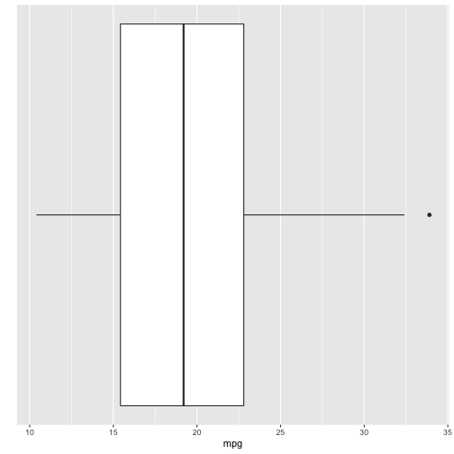
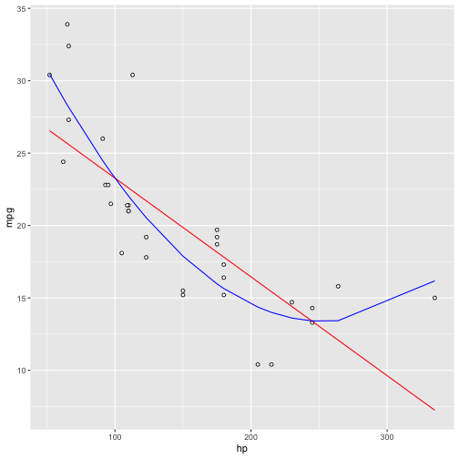

Developing Data Products Shiny Project

Explore the relationship between horsepower and mpg
========================================================
author: Rui Wang
date: Mar-01-2020
autosize: true
font-family: "Helvetica"

Product Overview
========================================================

The main idea behind this product is helping user explore the relationship between hp and mpg. And it also provided the visual camparision between simple linear model and ploynomial linear model. 

- *sidebar panel*
    - adjusting hp
    - displaying selected cars' name, hp and mpg
- *main panel*
    - Boxplot
    - Scatterplot with regression line

Boxplot Information
========================================================

The boxplot displayed the basic HorsePower information using boxplot. The redpoint on the boxplot corresponde with the hp slider value. This design was created for quick spot on where the selected value lies compared to the all cars' hp data.


```r
library(ggplot2)
ggplot(mtcars, aes(x = 1, y = mpg)) + 
    geom_boxplot(width = 0.3) + 
    scale_x_continuous("", breaks = NULL) + 
    coord_flip()
```



Scatter Plot Information Part 1
========================================================

Because of the limitation of the presentation, I can not echo the code here. Please check my github repo for the source code file for this part.

- *Select Model Lines Displayed On the Plot*
    
    The scatter plot mapped the hp and mpg on x and y axis respectively, and       user could also add the simple linear model regression line (red) and          polynomial linear model (blue) on it. As user selecting different hp value,     the predicted point based on two models will move correspondingly. 

- *Select Points On The Plot*
    
    Beside displaying two different model lines on scatter plot. Users could       also directly selecte points through the scatter plot. And the selected        points will display the cars' corresponding information on the left side       bar area as a dataframe format.

Scatter Plot Information Part 2
========================================================

This part provide some additional information about the two different model lines used in the analysis product. Users could clearly spot the prediction points moving on the two different lines, and compare their differences. 

- Simple Linear Model (Red)
    
    Created by formula `lm(mpg ~ hp)`, and shows exactly a straight line on the plot.
    
- Polynomial Linear Model (Blue)

    Created by formula `lm(mpg ~ poly(hp, 2))`, and shows a curve line on the plot.


